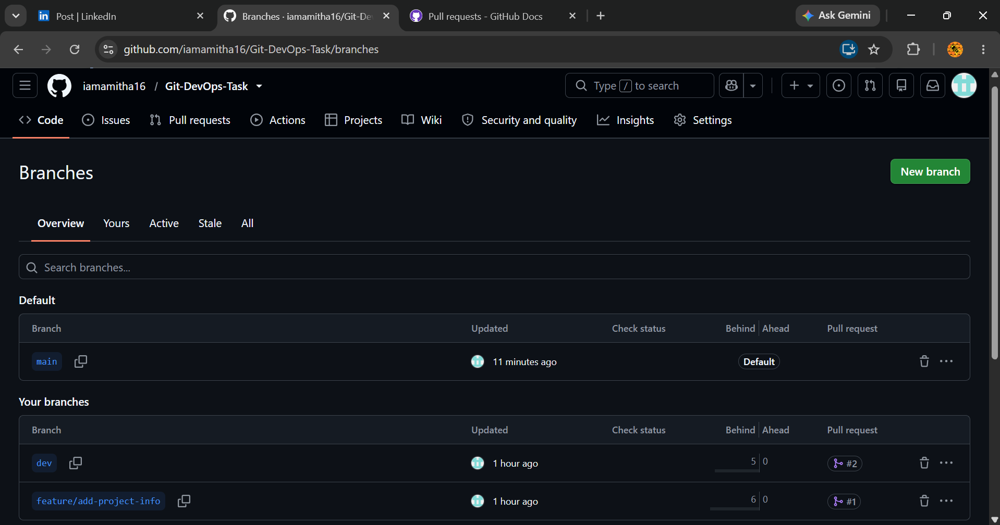
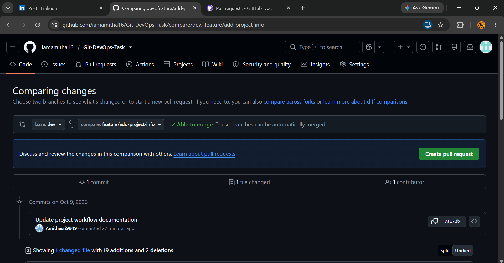
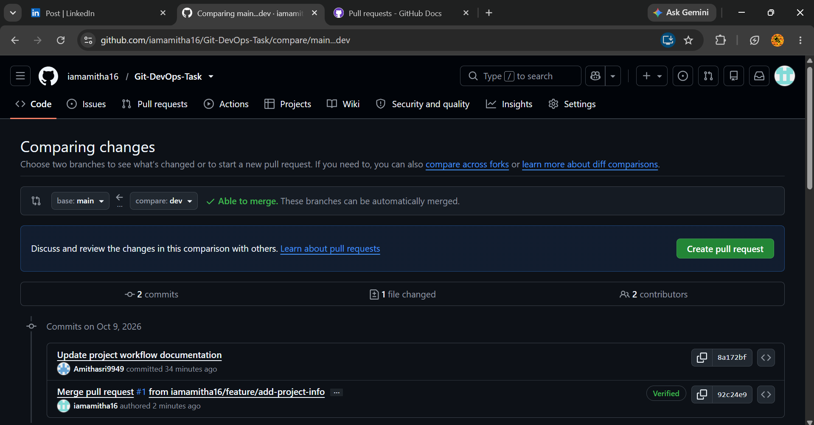
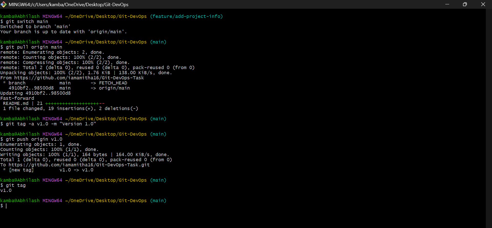
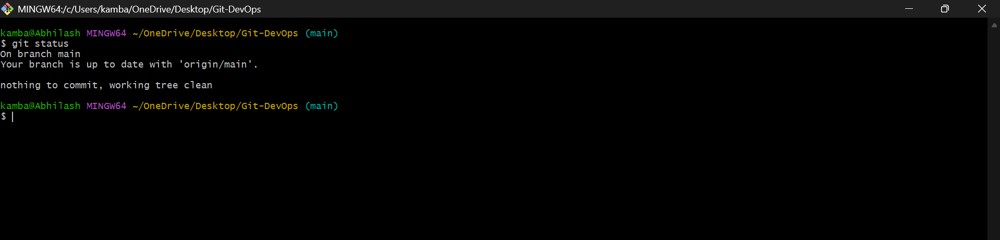

# Git DevOps Project

## DevOps Internship - Task 4

This project demonstrates version control and GitHub workflow practices using Git.

## Objective

The objective of this task is to manage a DevOps project using Git best practices.

## Tools Used

- Git
- GitHub
- Git Bash
- Visual Studio Code

## Project Structure

```text
Git-DevOps/
│
├── app/
│   └── index.html
│
├── docs/
│   └── git-workflow.md
│
├── screenshots/
│   ├── branches.png
│   ├── pr-feature-to-dev.png
│   ├── pr-dev-to-main.png
│   ├── git-tag-v1.0.png
│   └── final-git-status.png
│
├── .gitignore
└── README.md
```

## Version Control Workflow
This project follows a structured Git workflow.
Branches
- main - Stable production-ready branch
- dev - Development branch
- feature/add-project-info - Feature development branch
Development Process
1. Create a feature branch from dev.
2. Make changes in the feature branch.
3. Commit the changes.
4. Push the feature branch to GitHub.
5. Create a Pull Request.
6. Review and merge the Pull Request into dev.
7. Merge the tested changes into main.
8. Create a Git tag for the project version.

## Git Workflow
The project uses the following workflow:
main
  |
  dev
  |
  feature/add-project-info
  |
  Pull Request
  |
  Merge into dev
  |
  Pull Request
  |
  Merge into main
  |
  v1.0

## Git Concepts Demonstrated
- Git repository initialization
- Git commits
- Branching
- Feature development
- Pull Requests
- Merge
- .gitignore
- Git tags
- Markdown documentation

## Screenshots
1. Git Branches:
The following screenshot shows the remote GitHub branches:
- main
- dev
- feature/add-project-info


2. Pull Request - Feature to Dev:
This screenshot shows Pull Request #1, where the feature branch was merged into the dev branch.


3. Pull Request - Dev to Main:
This screenshot shows Pull Request #2, where the dev branch was merged into the main branch.


4. Git Tag:
The following screenshot shows the creation and push of the v1.0 Git tag.


5. Final Git Status:
The following screenshot shows that the local main branch is synchronized with origin/main and the working tree is clean.


## Conclusion
This project demonstrates how Git and GitHub can be used to manage source code using a structured version-control workflow. The project includes branching, commits, feature development, Pull Requests, merging, .gitignore, Git tags, and Markdown documentation.